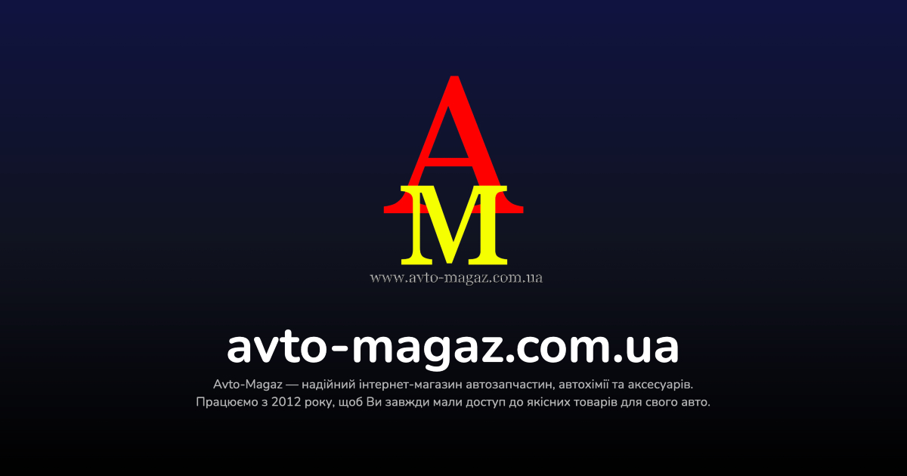

# WDS_template 💻.

**[View live page](https://webdevsynergy.vercel.app/en)**

---



## 🗂️ Project description 🗂️

A website for the **WDS_template** website development company.

- **Project name**: WDS_template
- **Project goals**:
  - Develop websites for your business for free.
  - Promotes the education and development of young professionals.
  - Provides an opportunity for businesses to cooperate with talented students.
  - Attracting new client / partners
- **Target audience**:
  - **Age**: 18-50+
  - **Gender**: All
- **Product scope**: Development of a multi-page website for the WDS company,
  whose main field of activity is web-developing

## ⚙️ Creating the project ⚙️

**WDS_template** is a [Next.js](https://nextjs.org/) project bootstrapped with
[`create-next-app`](https://github.com/vercel/next.js/tree/canary/packages/create-next-app).

### Features

- **Optimization**: The website is optimized for fast loading, providing users
  with quick access to information.
- **Modularity and reusability**: The product is built using a component
  approach, which makes the code modular and allows components to be used on
  different pages and in different sections of the project. This simplifies the
  maintenance of the site and the expansion of its functionality.
- **Linters and formatting**: Using tools like Prettier and ESLint helps
  maintain code standards, ensures a consistent style, and identifies potential
  problems in the code.
- **Adaptability**: The website is responsive, allowing you to create dynamic
  and interactive user interfaces without reloading pages. This increases user
  engagement and interaction.
- **Convenient content management**: The content management system has an
  intuitive interface that simplifies the process of updating and editing
  content. You can easily make changes to texts, images and other content
  without special knowledge in web development.
- **Accessibility**:
  - Intuitive design
  - Semantic HTML
  - Mobile-friendly interface
  - Web resource available for any internet connection

### Design

[Design layout on Figma](<https://www.figma.com/file/w0UKi99fF2QwHJL5NHc8vr/wds-(webdevsynergy)---website-portfolio---julia-kopytko?type=design&node-id=1304-60&mode=design&t=MKtlXN4sPoVkCyzp-0>)

### Project structure

```mermaid
graph LR

Z{Enter} --> L(Layout)
  L --> B(Header)
  L --> A((Home page))
  L --> C(Footer)
  B --> BA[Menu]

  A --> AA[Section 1. Name_template]
  A --> AB[Section 2. Name_template]
  A --> AC[Section 3. Name_template]
  A --> AD[Section 4. Name_template]
  A --> AE[Section 5. Name_template]
  A --> AF[Section 6. Name_template]
  A --> AG[Section 7. Name_template]


  BA --> D((Name_template_page))
  D --> DA[Section 1. Name_template_page Name_template]
  D --> DB[Section 2. Name_template_page Name_template]
  D --> DC[Section 3. Name_template]
  D --> DB[Section 4. Name_template]


  BA --> E((Name_template_page))
  E --> EA[Section 1. Name_template_page Name_template]
  E --> EB[Section 2. Name_template_page Name_template]
  E --> EC[Section 3. Name_template_page Name_template]


```

<details>

<summary><b>Project Organization and File Colocation: </b></summary>

<br/>

```

|-- public -> static files
|-- src -> source directory with the main application code
  |-- app -> pages and routing
    |-- / --> routing group for main UI
    |-- (Name_template_page) --> routing group for Name_template_page UI
    |-- (Name_template_page) --> routing group for Name_template_page UI
  |-- components -> folder with reusable components
    |-- base -> base sections/block components (accordion, form, slider, etc.)
    |-- ui -> small reusable components (button, modal, etc.)
      |-- NameComponent -> folders for each component
        |-- NameComponent.tsx -> main component
        |-- NameComponent.module.css -> file for special components styles
        |-- index.ts -> file for re-export
        |-- types.ts -> file for special components types (props)
  |-- layout -> components that are used as a main template (header, footer)
  |-- sections -> folder with section components
  |-- data -> static data for the project (json)
  |-- types -> folder with reusable type definitions
  |-- utils -> additional reusable functions

```

</details>

### Components API

Each component has its own API. You can find it in the component's folder. This
is a list of more common components and their API.

- #### Logo(example)

| Prop        | Default | Description                                                    |
| ----------- | ------- | -------------------------------------------------------------- |
| `location`  | -       | required, choose the position you'd need :'header' or 'footer' |
| `className` | ''      | optional, `string`, adds custom css class.                     |

- #### MainNav

| Prop       | Default   | Description                                                  |
| ---------- | --------- | ------------------------------------------------------------ |
| `location` | -         | required, choose the position you'd need :'header' or 'menu' |
| `onClick`  | undefined | click handler                                                |

- #### Modal(example)

Pure Modal Component which expect `onClose`:implements close modal window by
mouse click on backdrop or by press `ESC` button, `isOpen` - state to show/hide
modal, `children` -content for modal.

| Prop             | Default | Description                                                       |
| ---------------- | ------- | ----------------------------------------------------------------- |
| `children`       | -       | required, `ReactNode`, which will be content for modal window     |
| `isOpen`         | `false` | required, `boolean`, changes state to show/close the window.      |
| `onClose`        | -       | required, click handler for close modal window                    |
| `modalStyle`     | ''      | optional, `string`, additional css class you'd need               |
| `modalWrapStyle` | ''      | optional, `string`, additional css class you'd need for container |
| `backdropStyle`  | ''      | optional, `string`, additional css class you'd need               |

### 🚧 Technology stack

- **Main technologies**:

  - Next.js (app router)
  - TypeScript
  - Tailwind CSS

- **Additional dependencies**:

  - Clsx

  ...full list of dependencies is available in `package.json` file.

## 🗃️ Deployment 🗃️

To deploy this project, you need to perform the following steps:

1. **Clone the repository**: Use the `git clone` command to clone this
   repository to your computer.
2. **Install the dependencies**: Open a terminal in the root of the project and
   run `npm install` or `yarn install` to install all required dependencies.
3. **Setting environment variables**: Create a `.env` file in the root folder
   and add the necessary environment variables that you need for the project
   according to the `.env.example` file.
4. **Run the application**: Run the `npm run dev` or `yarn dev` command to run
   the project on the local server.
5. **Deploy**: To deploy this project to a production server, use hosting
   platforms such as Vercel, Netlify, or others.

## 📱 Contacts 📱

**WDS** is ready to answer your questions and provide additional information:

- **Website**: [webdevsynergy.vercel.app](webdevsynergy.vercel.app)
- **Phone**: <a href="tel:+380679995570">+380679995570</a>
- **Email**: [wds.webdevsynergy@gmail.com](mailto:wds.webdevsynergy@gmail.com)
